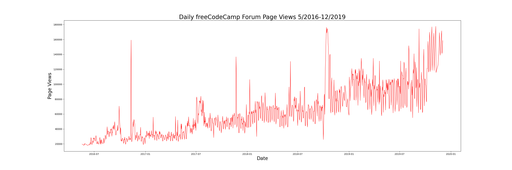
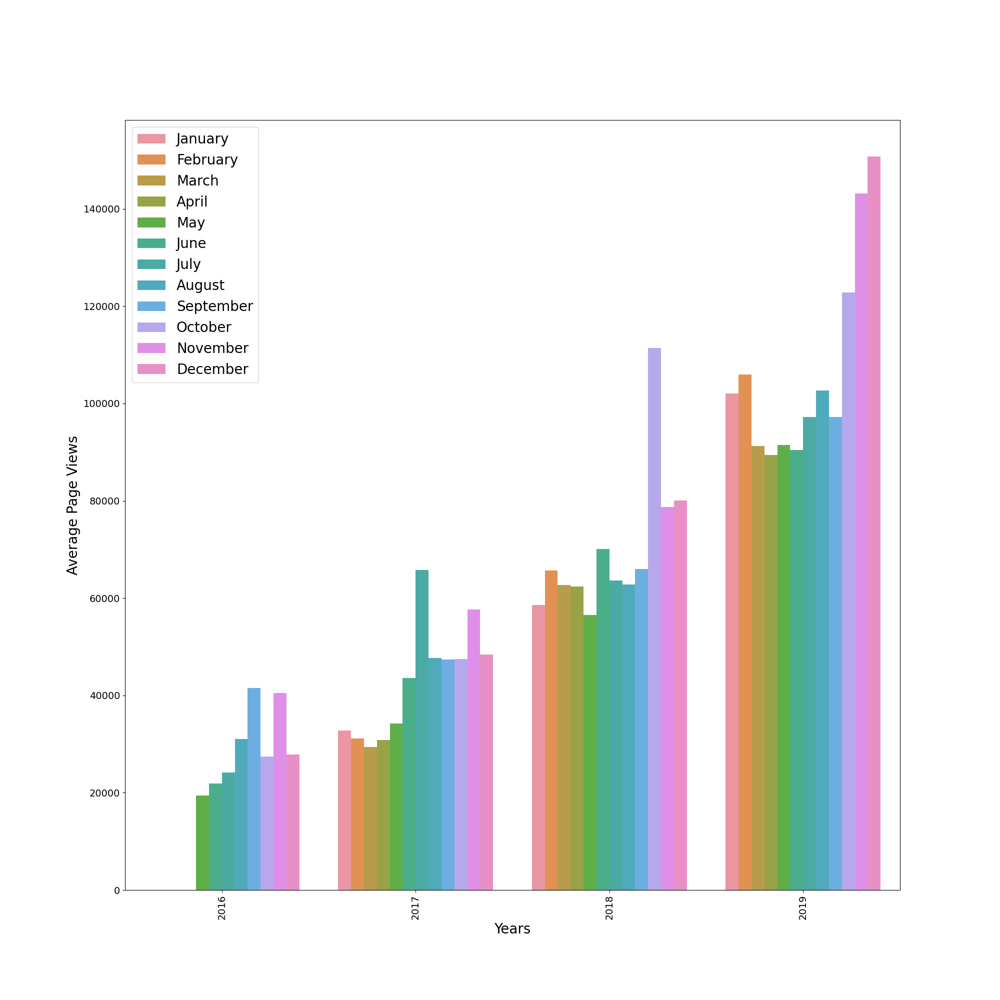
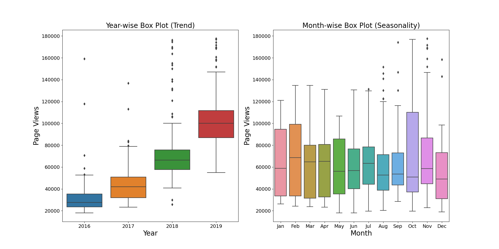

# Page View Time Series Visualizer

This project you will visualizes time series data using a line chart, bar chart, and box plots. You will use Pandas, Matplotlib, and Seaborn to visualize a dataset containing the number of page views each day on the freeCodeCamp.org forum from 2016-05-09 to 2019-12-03. The data visualizations are helpful to understand the patterns in visits and identify yearly and monthly growth.

## Screenshots

